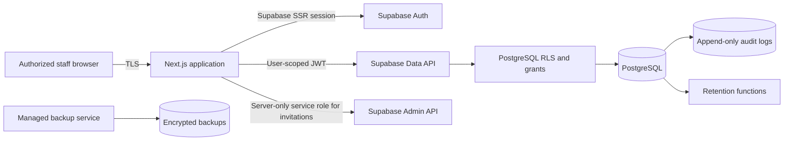

# Architecture

## Components

## Trust boundaries

1. The browser is untrusted. Role checks in the interface are usability controls only.
2. Next.js validates inputs and verifies the authenticated profile.
3. PostgreSQL functions re-check roles, organization, active status, service assignments, and MFA assurance.
4. Row-Level Security and grants deny direct table access that is not explicitly required.
5. The service-role key is available only to server-side invitation code.
6. Supabase Auth owns password hashing, reset tokens, session refresh, and TOTP factors.

## Request flow

1. `proxy.ts` refreshes the server-managed Supabase session and redirects anonymous requests.
2. protected layouts load the current active profile from PostgreSQL;
3. administrators who have not reached `aal2` are redirected to MFA;
4. Server Actions validate form data with Zod;
5. transaction-safe PostgreSQL functions enforce business and authorization rules;
6. RLS prevents direct API access across organizations;
7. sensitive changes write safe audit events without names, contact details, passwords, or tokens.

## Availability

- deploy the standalone Next.js build to a managed platform;
- use a paid Supabase plan with daily backups and point-in-time recovery where required;
- configure uptime monitoring for `/api/health`;
- define RTO and RPO before launch;
- test restoration before real visitor data is entered.
