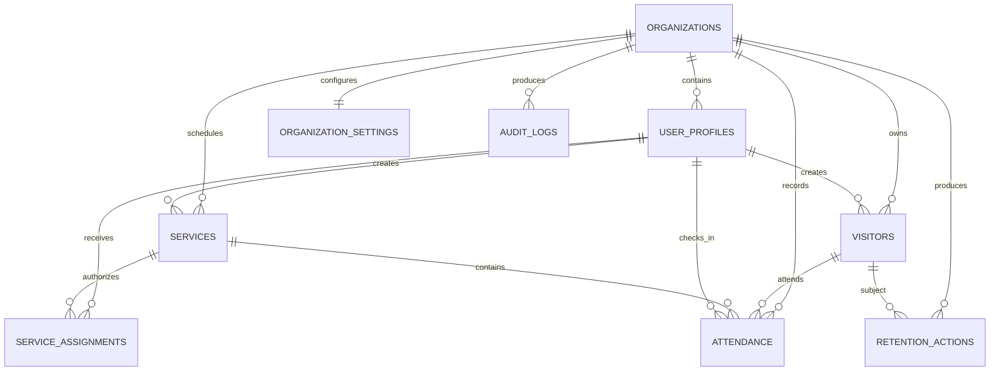

# Database documentation

## Tables

| Table | Purpose | Important controls |
|---|---|---|
| `organizations` | Tenant/church boundary | UUID primary key |
| `user_profiles` | Staff identity, role, active state | References `auth.users`; `auth_not_before` revokes older sessions |
| `organization_settings` | Retention and assignment policy | One row per organization |
| `visitors` | Minimum visitor identity and optional consented contact | Contact requires consent; anonymization state constraint |
| `services` | Individual church gatherings | Organization-scoped uniqueness |
| `service_assignments` | Which ushers may operate a service | Composite primary key |
| `attendance` | Positive check-in events only | Unique organization/visitor/service constraint; auditable void fields |
| `audit_logs` | Safe accountability events | No names, contact data, passwords, or tokens |
| `retention_actions` | Evidence of approved disposal/anonymization | Restricted to administrators |

## Entity relationship diagram

## Business integrity

- A visitor name is not a unique identifier.
- Duplicate names are supported through UUID records and first/last-seen context.
- A visitor can have only one attendance record per service.
- Corrected attendance is voided with actor, time, and reason rather than silently removed.
- No permanent “absent” rows are stored.
- Registration plus first check-in runs in one PostgreSQL transaction.
- Cross-organization foreign-key combinations are rejected.
- Service assignment is checked inside security-definer functions.
- Application users receive no direct write privileges to core tables.

## Migrations

1. `202606230001_schema.sql` — schema, keys, checks, indexes, triggers.
2. `202606230002_rls.sql` — identity helpers, grants, and Row-Level Security.
3. `202606230003_application_functions.sql` — validated transactional API.
