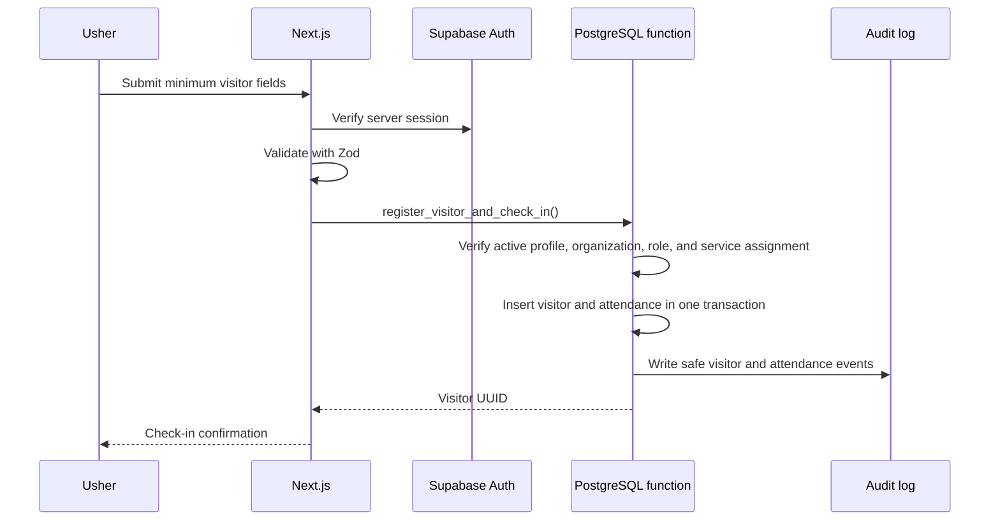

# Data-flow summary

## Visitor registration and check-in

## Data classifications

| Classification | Examples | Handling |
|---|---|---|
| Restricted | Visitor name plus attendance, optional contact | TLS, RLS, minimum display, retention |
| Confidential | Staff profile, roles, audit events | Role-restricted, append-only where applicable |
| Internal | Service name, date, aggregate counts | Authenticated access |
| Public | None by default | No public application data |

## Prohibited application data

Addresses, birth dates, identification numbers, health details, prayer
requests, counseling notes, financial information, and information about
minors are outside the approved schema.
