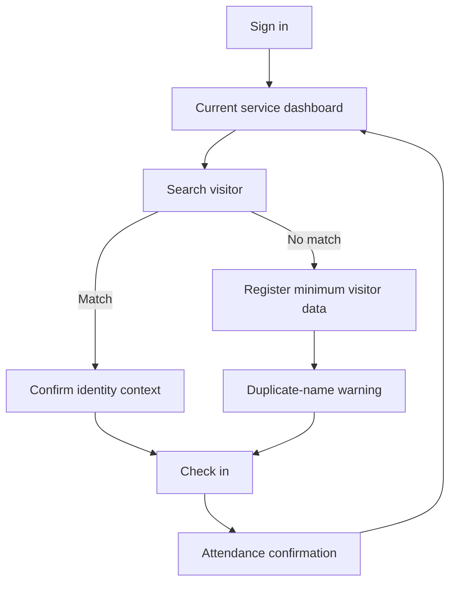
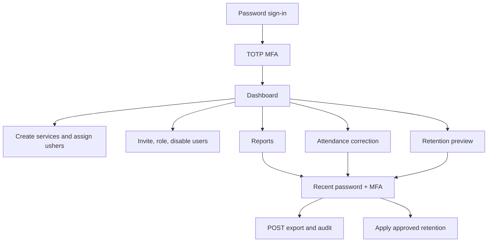

# User flows and screen map

## Usher

## Administrator

## Read-only leader

Sign in → aggregate dashboard → date-limited attendance reports → sign out.
Visitor search, named attendance, writes, raw exports, audit, and administration
are unavailable.

## Screen inventory

1. Secure login
2. Password recovery
3. Administrator MFA
4. Recent reauthentication
5. Current-service dashboard
6. Visitor search and registration
7. Current attendance
8. Service and usher assignment management
9. Aggregate reports and protected export
10. User and role management
11. Audit log
12. Privacy and retention settings
