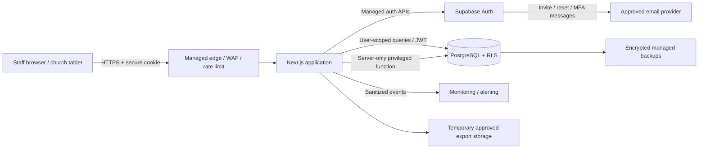
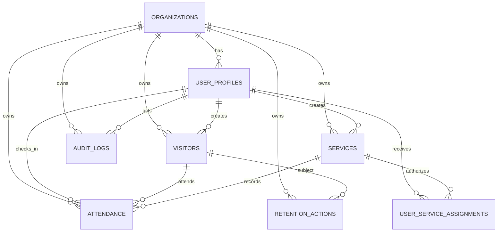

# 4. Proposed Architecture and Database Model

## 4.1 Recommended stack

- **Frontend/application:** Next.js with TypeScript strict mode
- **Authentication:** Supabase Auth using managed password reset/invitation and MFA capability
- **Database:** Managed Supabase PostgreSQL
- **Authorization:** Server-side RBAC plus PostgreSQL Row-Level Security
- **Application hosting:** Managed Next.js hosting with TLS, protected environment variables, preview-environment controls, and deployment logs
- **Rate limiting:** Managed edge/KV-backed limiter or hosting-provider control
- **Monitoring:** Sanitized application/security events plus provider database/auth logs
- **Backups:** Managed encrypted database backups with an approved recovery copy and tested restore procedure

This stack is recommended because it supports managed authentication, PostgreSQL constraints, RLS, server-side logic, managed encryption, backups, and secure secrets management. Platform configuration still requires verification.

## 4.2 Architectural principles

1. No browser receives a service-role key or database password.
2. The browser uses a secure server-managed session cookie.
3. Every state-changing request is validated on the server.
4. UI checks improve usability; server and database checks enforce security.
5. User-scoped database operations run under the authenticated user context so RLS remains active.
6. Privileged administrative functions use narrowly scoped server-only code and still enforce role, organization, reauthentication, and audit requirements.
7. Organization identity is derived from the authenticated profile, never trusted from a form field.
8. Logs use UUIDs and safe event fields, not names/contact/raw payloads.
9. Exports are generated server-side with approved columns and temporary access.
10. Retention actions use preview, approval, transaction/batch execution, and audit.

## 4.3 Logical component diagram

## 4.4 Data-flow summary

### Login

1. Staff submits credentials over HTTPS.
2. Managed authentication validates credentials and rate limits.
3. Session identifiers are placed in secure, HttpOnly, SameSite cookies.
4. The application loads the active user profile and organization.
5. Inactive or missing profiles are denied.

### Visitor registration

1. Server validates normalized name, date, optional contact, and consent.
2. Server searches possible duplicate names within the organization.
3. User confirms registration if necessary.
4. Database inserts visitor under RLS.
5. Audit function records action, resource UUID, actor UUID, outcome, and safe metadata.
6. No name/contact is copied to audit logs.

### Check-in

1. Server validates visitor UUID and service UUID.
2. Authorization verifies user role, organization, service assignment, and service status/window.
3. Database inserts attendance.
4. Unique constraint prevents duplicates under concurrency.
5. Audit event records success or safe duplicate outcome.
6. UI displays a clear confirmation.

### Export

1. Administrator completes MFA and recent reauthentication.
2. Server validates purpose, role, organization, date range, and approved columns.
3. Server queries data under a narrow privileged function.
4. Export event is audited before/after generation.
5. File is stored temporarily and access expires.
6. Export policy governs the administrator’s device and onward handling.

## 4.5 Required database entities

### `organizations`

| Column | Type | Constraints |
|---|---|---|
| `id` | UUID | PK, default generated UUID |
| `name` | text | not null, length bound |
| `created_at` | timestamptz | not null, server default |

### `user_profiles`

`id` should equal/reference the managed authentication user UUID.

| Column | Type | Constraints |
|---|---|---|
| `id` | UUID | PK, FK to auth user |
| `organization_id` | UUID | FK organizations, not null |
| `display_name` | text | not null, length bound |
| `role` | enum/check | `administrator`, `usher`, `auditor` |
| `active` | boolean | not null, default true |
| `created_at`, `updated_at` | timestamptz | not null |

### `visitors`

| Column | Type | Constraints |
|---|---|---|
| `id` | UUID | PK |
| `organization_id` | UUID | FK, not null |
| `full_name` | text | not null, normalized/length checked |
| `preferred_name` | text | nullable, length checked |
| `first_visit_date` | date | not null |
| `optional_contact` | text | nullable, encrypted/protected where supported |
| `contact_consent` | boolean | not null, default false |
| `active` | boolean | not null, default true |
| `created_at`, `updated_at` | timestamptz | not null |
| `created_by` | UUID | FK user_profiles, not null |

Constraint: `optional_contact IS NULL OR contact_consent = true`.

Recommended Phase 2 additions: `contact_type`, `contact_consent_at`, and fixed `contact_purpose`.

### `services`

| Column | Type | Constraints |
|---|---|---|
| `id` | UUID | PK |
| `organization_id` | UUID | FK, not null |
| `service_name` | text | not null, length checked |
| `service_date` | date | not null |
| `start_time` | time | not null |
| `status` | enum/check | recommended: draft/open/closed/cancelled |
| `active` | boolean | retained if required by specification |
| `created_by` | UUID | FK user_profiles |
| `created_at` | timestamptz | not null |

### `attendance`

| Column | Type | Constraints |
|---|---|---|
| `id` | UUID | PK |
| `organization_id` | UUID | FK, not null |
| `visitor_id` | UUID | FK visitors, not null |
| `service_id` | UUID | FK services, not null |
| `checked_in_at` | timestamptz | not null |
| `checked_in_by` | UUID | FK user_profiles, not null |
| `created_at` | timestamptz | not null |

Unique: `(organization_id, visitor_id, service_id)`.

The application and/or a database trigger must also verify that visitor, service, and user all belong to the same organization.

### `audit_logs`

| Column | Type | Constraints |
|---|---|---|
| `id` | UUID | PK |
| `organization_id` | UUID | FK, not null |
| `actor_user_id` | UUID | nullable for pre-auth failures/system events |
| `action` | text/enum | not null |
| `resource_type` | text/enum | not null |
| `resource_id` | UUID | nullable |
| `event_timestamp` | timestamptz | not null |
| `outcome` | text/enum | success/failure/denied |
| `safe_metadata` | jsonb | schema-limited, no PII/secrets |

No normal update/delete policy. Insert through a controlled function.

### `retention_actions`

| Column | Type | Constraints |
|---|---|---|
| `id` | UUID | PK |
| `organization_id` | UUID | FK |
| `action_type` | text/enum | preview/delete/anonymize/hold/release |
| `visitor_id` | UUID | nullable after anonymization as policy permits |
| `performed_by` | UUID | FK user_profiles |
| `performed_at` | timestamptz | not null |
| `reason` | text/enum | approved reason code, not sensitive free text |

## 4.6 Recommended supporting entities

- `user_service_assignments`: limits ushers to authorized services.
- `organization_settings`: retention values, timezone, report controls, and security policy bounds.
- `data_subject_requests`: correction/deletion request workflow and status.
- `attendance_corrections`: before/after identifiers and reason code without unnecessary PII.
- `export_jobs`: purpose, filters, columns, requester, status, expiry, and audit linkage.
- `legal_holds`: prevents retention deletion when formally required.
- `security_events`: may remain in `audit_logs` if the safe schema is sufficient.

## 4.7 Entity relationship diagram

## 4.8 Index plan

- `user_profiles (organization_id, active, role)`
- `visitors (organization_id, active, lower(full_name))`
- `visitors (organization_id, first_visit_date)`
- Optional trigram index for approved fuzzy search after leakage/performance review
- `services (organization_id, service_date, start_time)`
- `services (organization_id, status)`
- `attendance (organization_id, service_id, checked_in_at)`
- `attendance (organization_id, visitor_id, checked_in_at desc)`
- Unique `attendance (organization_id, visitor_id, service_id)`
- `audit_logs (organization_id, event_timestamp desc)`
- `audit_logs (organization_id, actor_user_id, event_timestamp desc)`
- `retention_actions (organization_id, performed_at desc)`

## 4.9 Preliminary Row-Level Security policy design

RLS shall be enabled and forced on every protected application table.

| Table | Administrator | Usher | Auditor |
|---|---|---|---|
| organizations | Read own organization | Read minimal own organization | Read own organization |
| user_profiles | Manage own organization with safeguards | Read own profile only | Read own profile only |
| visitors | Read/create/update within own organization | Read/create within own organization; update only approved registration correction if allowed | No raw access by default |
| services | Manage own organization | Read assigned/open services | Read report-relevant services |
| attendance | Read/create/correct within own organization | Read/create only for assigned services; no update/delete | Aggregate/report path only |
| audit_logs | Read own organization; insert only via controlled function | No system-wide read; controlled event insertion only | No raw log by default |
| retention_actions | Manage approved workflow | No access | Read summary only if approved |
| exports | Manage approved own-organization jobs | No access | No raw export |

Policy predicates must derive organization and role from trusted authenticated profile data. A request-supplied `organization_id` is never sufficient.

## 4.10 Backup and recovery design baseline

- Automated encrypted backups at least daily; point-in-time recovery is preferred.
- Backup administration limited to designated technical administrators with MFA.
- Provider-managed/off-site recovery copy.
- Proposed initial objectives for approval: RPO 24 hours and RTO 8 hours. More stringent objectives may require additional cost and design.
- Quarterly restore exercise in an isolated environment using fictional or appropriately controlled data.
- Restore checklist includes integrity checks, authentication checks, RLS checks, retention reconciliation, secret rotation if needed, and approval before reopening.
- The application shall not be described as production-ready until a restore test succeeds.
