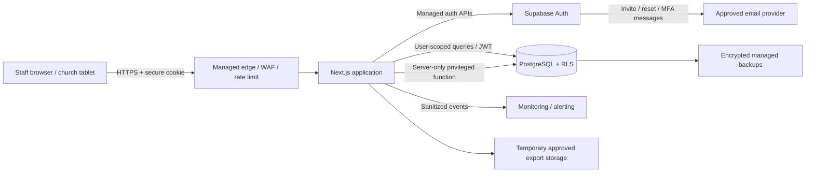
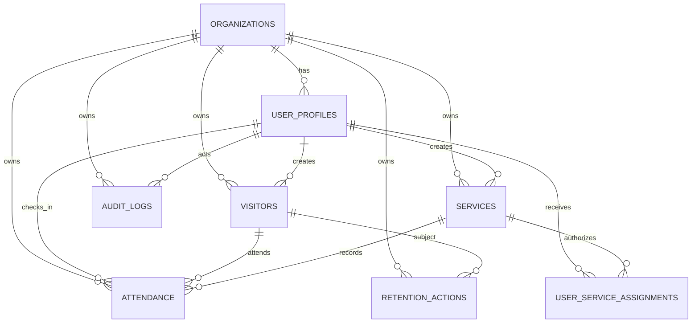

# Church Visitor Attendance System — Phase 1 Requirements and Risk Assessment

**Version:** 0.1

**Status:** Design baseline; administrator approval required; not production-ready.

This document is intentionally limited to Phase 1. No claim of complete security or production readiness is made.

---

# 1. Requirements Specification

## 1.1 Purpose and scope

The Church Visitor Attendance System will be a private, staff-only web application for registering first-time visitors, locating returning visitors, checking visitors into a church service, viewing role-appropriate attendance information, and administering users, services, reports, corrections, retention, and security.

The system is not a church membership database, pastoral-care system, donor system, child-management system, counseling system, or prayer-request repository. Those purposes require separate approval, safeguards, and data models.

## 1.2 Stakeholders

| Stakeholder | Interest |
|---|---|
| Church governing body/system owner | Accountable use, policy approval, funding, and risk acceptance |
| Church administrator | User, service, correction, report, retention, and security administration |
| Ushers | Fast and reliable visitor registration and check-in |
| Auditor/read-only leader | Approved aggregate or read-only oversight |
| Visitors/data subjects | Fair notice, privacy, accuracy, correction, deletion, and secure handling |
| Privacy contact/data protection officer | Privacy compliance, requests, impact assessment, and breach coordination |
| Technical administrator/provider | Secure deployment, backup, monitoring, maintenance, and recovery |

## 1.3 Functional requirements

### Authentication and account lifecycle

- **FR-001:** The system shall deny access to all visitor, attendance, service, report, user, and audit data unless the requester has an authenticated, active account.
- **FR-002:** Every staff member shall use an individual account; shared usher accounts shall be prohibited.
- **FR-003:** Administrators shall use multi-factor authentication.
- **FR-004:** The system shall support secure invitation, password reset, account disabling, and session revocation through managed authentication.
- **FR-005:** A deactivated user shall be unable to establish a new session, and existing sessions shall be revocable.
- **FR-006:** Authentication failures shall use generic error messages and be rate-limited.

### Visitor registration and search

- **FR-010:** An authorized usher or administrator shall be able to register a first-time visitor using the approved minimum data fields.
- **FR-011:** Before registration, the system shall search for possible duplicates using normalized name matching and present a warning without asserting that two people are the same.
- **FR-012:** Duplicate names shall be permitted and distinguished by UUID, first-visit date, preferred name, and limited contextual information.
- **FR-013:** Names shall never be used as record identifiers or uniqueness constraints.
- **FR-014:** Optional contact information shall be collected only when the visitor gives clear consent for an approved purpose.
- **FR-015:** The registration workflow shall clearly distinguish first-time registration from returning-visitor check-in.
- **FR-016:** Authorized users shall be able to search active visitors by full or preferred name.
- **FR-017:** Search results shown to ushers shall contain only the minimum information needed to choose the correct record.
- **FR-018:** Administrators shall be able to correct visitor records, with the change and outcome recorded in the audit trail.
- **FR-019:** Records shall use soft deactivation when immediate physical deletion would conflict with audit or retention duties.

### Services and check-in

- **FR-020:** An administrator shall be able to create, update, activate, close, or cancel a service.
- **FR-021:** Each service shall belong to exactly one organization and have a name, date, start time, status, creator, and timestamps.
- **FR-022:** Ushers shall record attendance only for services for which they are authorized.
- **FR-023:** An authorized user shall be able to check an active visitor into an open/authorized service.
- **FR-024:** The database shall prevent the same visitor from being checked into the same service more than once, including under concurrent requests.
- **FR-025:** A successful check-in shall give a clear, accessible confirmation.
- **FR-026:** A duplicate check-in attempt shall return a safe, user-friendly message without creating a second record.
- **FR-027:** Attendance shall be represented only by a positive check-in record. The system shall not create an “absent” row for every visitor.
- **FR-028:** Non-attendance shall be calculated from the absence of an attendance record.
- **FR-029:** Attendance corrections shall be restricted to administrators and shall be auditable.
- **FR-030:** The current attendance list shall be limited by role and service authorization.

### Dashboards and reports

- **FR-040:** The current-service dashboard shall show role-appropriate counts for total attendance, first-time visitors, and returning visitors.
- **FR-041:** Approved reports may include weekly trends, service comparison, and visitors not seen during a configurable period.
- **FR-042:** Charts and summary widgets shall not expose names or contact details.
- **FR-043:** Ushers shall not export raw visitor or attendance data.
- **FR-044:** Read-only leaders shall view only approved reports and shall not modify visitor or attendance records.
- **FR-045:** Raw-data export shall be restricted to authorized administrators, require recent reauthentication, and create an audit event.
- **FR-046:** Export files shall contain only approved columns and shall expire or be deleted after an approved short period.
- **FR-047:** Reports shall enforce organization boundaries and the requesting user’s role.

### Audit, privacy, retention, and requests

- **FR-050:** The system shall log login successes/failures, lockouts, authorization failures, user lifecycle actions, role changes, visitor creation/modification, attendance corrections, exports, retention actions, and security-setting changes.
- **FR-051:** Audit metadata shall not contain visitor names, contact details, passwords, tokens, secrets, or raw request bodies.
- **FR-052:** Normal application users shall not be able to update or delete audit-log records.
- **FR-053:** Administrators shall be able to configure approved retention values within policy-controlled bounds.
- **FR-054:** Retention runs shall support review, approval, execution, and audit.
- **FR-055:** Deletion shall remove or irreversibly anonymize personal identifiers when the approved purpose and retention period end, subject to legal holds and audit-integrity needs.
- **FR-056:** The system shall support documented correction and deletion-request workflows.
- **FR-057:** Aggregate statistics may be retained only after they are irreversibly de-identified.
- **FR-058:** Privacy and retention settings shall be visible only to authorized administrators.

### Administration

- **FR-060:** Administrators shall manage users, roles, service assignments, active status, and session revocation.
- **FR-061:** Role changes and account disabling shall require confirmation and recent reauthentication.
- **FR-062:** The system shall prevent the last active administrator from accidentally removing their own required administrative access without a controlled recovery process.
- **FR-063:** Administrative actions shall be denied by default unless explicitly permitted.
- **FR-064:** No privileged database credential or service-role key shall be sent to a browser.

## 1.4 User roles and permission matrix

| Capability | Administrator | Usher | Auditor/Read-only Leader |
|---|---:|---:|---:|
| Sign in with individual account | Yes | Yes | Yes |
| Register a visitor | Yes | Yes | No |
| Search visitors | Yes | Yes, minimum fields | No raw visitor search by default |
| Check in visitor | Yes | Yes, assigned/open services | No |
| View current attendance list | Yes | Assigned service only | Approved summary only |
| Create/manage services | Yes | No | No |
| Correct visitor record | Yes | No | No |
| Correct attendance | Yes | No | No |
| View aggregate reports | Yes | Limited current-service metrics | Yes, approved reports |
| Export raw personal data | Approved admins only | No | No, unless separately authorized |
| Manage users/roles | Yes | No | No |
| Configure retention | Yes | No | No |
| Review system-wide audit log | Yes | No | No |
| Delete/anonymize under retention workflow | Approved admins only | No | No |

A privacy officer or data protection officer is a governance responsibility. It does not automatically require a separate application role; the church may assign that responsibility to a tightly controlled administrator or introduce a dedicated role in Phase 2.

## 1.5 Core user stories

- **US-001:** As an usher, I can sign in with my own account so that my activity is attributable to me.
- **US-002:** As an usher, I can search for a returning visitor quickly so that check-in does not delay the service.
- **US-003:** As an usher, I receive a duplicate-name warning before creating a visitor so that I do not unintentionally create multiple records.
- **US-004:** As an usher, I can register a first-time visitor with only the approved minimum information.
- **US-005:** As an usher, I can check a visitor into an authorized current service and receive a clear confirmation.
- **US-006:** As an usher, I cannot see administrative controls, raw exports, full audit history, or unnecessary contact details.
- **US-007:** As an administrator, I can create services and assign ushers so that attendance can only be recorded for authorized gatherings.
- **US-008:** As an administrator, I can correct a record while preserving who changed it, when, why, and whether it succeeded.
- **US-009:** As an administrator, I can disable an account and revoke its sessions when a staff member leaves.
- **US-010:** As an administrator, I can run an approved retention process that deletes or anonymizes expired personal data.
- **US-011:** As an auditor/read-only leader, I can view approved summary reports without changing data or viewing unnecessary personal information.
- **US-012:** As a visitor, I can understand what information is collected, why, who can access it, how long it is kept, and how to request correction or deletion.

## 1.6 Business rules

- **BR-001:** A visitor is registered once when the church can reasonably identify an existing record; duplicate names remain permitted.
- **BR-002:** A service represents one church gathering.
- **BR-003:** Attendance is a link between one visitor and one service.
- **BR-004:** One visitor may have no more than one attendance row for the same service.
- **BR-005:** Absence is derived, not stored.
- **BR-006:** Ushers may check in only to authorized services within the permitted check-in window.
- **BR-007:** Corrections must be attributable, justified, and auditable.
- **BR-008:** Raw personal data is never public.
- **BR-009:** Only approved administrators may export personal data, and every export is logged.
- **BR-010:** Contact information is optional and purpose-limited.
- **BR-011:** Consent is required before optional contact information is stored.
- **BR-012:** Expired personal data is deleted or anonymized under an approved workflow.
- **BR-013:** Real personal data is prohibited in development, test, demonstrations, screenshots, and portfolio material.
- **BR-014:** Cross-organization access is prohibited even when record identifiers are known.
- **BR-015:** Client-side role checks are usability controls only; server and database enforcement are authoritative.

## 1.7 Non-functional requirements

### Security and privacy

- **NFR-001:** Target OWASP ASVS 5.0.0 Level 2 overall, with higher-assurance controls for administrative actions, exports, audit logs, and retention.
- **NFR-002:** Apply deny-by-default access at the user interface, server, and database layers.
- **NFR-003:** Encrypt traffic with TLS and use managed encryption at rest.
- **NFR-004:** Keep secrets only in protected server-side environment configuration.
- **NFR-005:** Use parameterized database access and strict input schemas.
- **NFR-006:** Prevent PII from appearing in URLs, logs, analytics, error messages, and audit metadata.
- **NFR-007:** Support secure cookies, idle timeout, absolute session lifetime, session rotation/revocation, and reauthentication for high-risk actions.
- **NFR-008:** Apply CSRF protection, content security policy, HSTS, frame protection, content-type protection, and restrictive referrer policy.
- **NFR-009:** Pin dependencies and run automated SAST, dependency, and secret scanning.
- **NFR-010:** Maintain append-only audit behavior for normal application paths.

### Availability and recovery

- **NFR-020:** The application shall use managed hosting and managed PostgreSQL with documented backup capability.
- **NFR-021:** Backup access shall be restricted and encrypted.
- **NFR-022:** Recovery objectives shall be approved before production.
- **NFR-023:** Production readiness requires a successful documented restore test.
- **NFR-024:** Critical check-in operations shall fail safely and avoid partial writes.
- **NFR-025:** Service status and database health shall be monitored without collecting unnecessary personal data.

### Performance and usability

- **NFR-030:** The interface shall be mobile and tablet responsive.
- **NFR-031:** Touch targets shall be large and workflows shall minimize typing.
- **NFR-032:** Search and check-in should feel immediate under the approved expected load; measurable performance thresholds will be set after expected volume is confirmed.
- **NFR-033:** All controls shall have accessible labels and support keyboard navigation.
- **NFR-034:** Success, loading, empty, validation, authorization, and system-failure states shall be clear.
- **NFR-035:** Destructive actions shall require confirmation.
- **NFR-036:** Sensitive data shall not remain visible longer than necessary on shared tablets.

### Maintainability and assurance

- **NFR-040:** TypeScript strict mode shall be enabled.
- **NFR-041:** UI, business logic, authorization, and data-access concerns shall be separated.
- **NFR-042:** Database changes shall use reviewed migrations.
- **NFR-043:** Security decisions shall be documented near non-obvious implementation points.
- **NFR-044:** Test data shall be fictional and deterministic.
- **NFR-045:** Releases shall pass functional, authorization, security, migration, and backup gates.

## 1.8 Data classification

| Classification | Examples | Handling |
|---|---|---|
| Restricted | Visitor name, preferred name, attendance history, optional contact, user identity mappings | Need-to-know access, encryption, RLS, minimal display, no public links, strict retention |
| Confidential | Roles, service assignments, security settings, audit events without PII, retention actions | Staff/admin access according to role, integrity controls, audit |
| Internal | De-identified aggregate attendance counts, system health metrics | Authenticated access unless approved for wider use |
| Public | Approved privacy notice and public contact channel | May be published after approval |

Visitor attendance can reveal religious association. It shall be treated as highly sensitive even where the applicable law uses different terminology.

## 1.9 Acceptance criteria summary

Phase 1 requirements will be considered accepted when:

1. The church approves the purpose, roles, minimum data, and prohibited data.
2. The applicable privacy jurisdiction and accountable data controller are identified.
3. Retention periods and deletion/anonymization rules are approved.
4. Service assignment, correction, and export workflows are approved.
5. Recovery objectives and hosting/data-region constraints are approved.
6. The security acceptance criteria in `05_SECURITY_CONTROLS_AND_ACCEPTANCE.md` are adopted.
7. Any unresolved blocking decisions are documented as formally accepted risks or assumptions.

---

# 2. Privacy Impact Assessment

## 2.1 Assessment summary

**Overall inherent privacy risk:** High  
**Reason:** The system combines identifiable names with repeated attendance at religious services. A disclosure could expose personal relationships or religious association. Optional contact information increases risk and therefore must remain genuinely optional, consent-based, purpose-limited, and separately protected.

**Target residual risk after controls:** Medium, subject to legal review, configuration review, access testing, and operational discipline.

## 2.2 Processing purpose

Approved primary purposes:

1. Identify first-time and returning adult visitors.
2. Record positive attendance at a specific church service.
3. Produce restricted operational and aggregate attendance reports.
4. Correct records, respond to privacy requests, and meet security/accountability requirements.

Prohibited secondary use without a new assessment and explicit approval:

- Membership profiling
- Pastoral/counseling profiling
- Fundraising or donation solicitation
- Political outreach
- Unrelated marketing
- Sharing with third parties
- Automated scoring or sensitive segmentation
- Recording children/minors
- Inferring beliefs beyond the fact of attendance

## 2.3 Minimum recommended data

### Visitor record

| Field | Required? | Purpose | Privacy note |
|---|---:|---|---|
| `id` (UUID) | Yes | Stable internal identifier | Never expose sequential identifiers |
| `organization_id` | Yes | Tenant isolation | Enforced by RLS |
| `full_name` | Yes | Search and identification | Restricted |
| `preferred_name` | No | Respectful display and duplicate handling | Restricted |
| `first_visit_date` | Yes | First-time/returning calculation | Date only unless a timestamp is necessary |
| `optional_contact` | No | Approved follow-up only | Store only with consent; mask by default |
| `contact_consent` | Conditional | Proof that contact storage was authorized | Must be true if contact exists |
| `contact_consent_at` | Recommended | Accountability | Add in Phase 2 |
| `contact_purpose` | Recommended | Purpose limitation | Fixed approved enum, not free text |
| `active` | Yes | Soft deactivation | Not a substitute for retention deletion |
| `created_at`, `updated_at`, `created_by` | Yes | Integrity/accountability | `created_by` is a user UUID |

### Service and attendance

Only service identity, date/time, status, visitor UUID, check-in timestamp, and checking-in user UUID are needed. Do not add notes to attendance.

### User profile

Store only managed authentication identifier, organization, display name, role, active status, timestamps, and approved service assignments. Authentication secrets remain in the managed identity provider.

## 2.4 Data that shall not be collected

Unless a separate project, lawful purpose, assessment, and safeguards are approved, the system shall not collect:

- Home or work addresses
- Dates of birth or age
- National identification, passport, tax, driver’s licence, or other ID numbers
- Health, disability, or medical information
- Prayer requests
- Counseling, pastoral-care, confession, or safeguarding notes
- Financial, banking, donation, or card information
- Photographs, biometrics, or facial recognition data
- Information about minors
- Immigration or citizenship status
- Employment information
- Political opinions
- Family relationships
- Free-form “notes” fields
- Device fingerprinting or unnecessary analytics identifiers
- Precise geolocation
- Social-media profiles

## 2.5 Privacy principles and controls

| Privacy risk | Control |
|---|---|
| Excessive collection | Fixed schemas, no free-text notes, required field review |
| Unclear purpose | Privacy notice, purpose limitation, approved contact purpose |
| Unnecessary contact data | Optional field, explicit consent, mask by default, shorter retention |
| Insider browsing | Individual accounts, least privilege, service assignment, audit, periodic access review |
| Cross-organization disclosure | `organization_id` on every protected row, server checks, RLS |
| Data retained indefinitely | Configurable retention, review queue, deletion/anonymization, retention audit |
| Inaccurate records | Correction workflow, duplicate warning, auditable changes |
| Hidden secondary use | Governance approval required for any new use |
| Exposure in logs | Structured safe metadata with identifiers only; no names/contact/raw bodies |
| Public reporting | Aggregate-only reports with minimum-cell-size review if small groups could be identifiable |
| Lost tablet | Short idle timeout, secure cookie, remote account/session revocation, device controls |
| Export leakage | Admin-only, reauthentication, purpose selection, minimal columns, watermark/expiry where feasible, audit |

## 2.6 Recommended retention schedule for approval

These are starting recommendations, not legal conclusions:

| Data | Proposed default | End-of-period action |
|---|---:|---|
| Optional contact information | 12 months after last attendance or consent withdrawal, whichever is earlier | Delete contact value and consent metadata not required for proof/accountability |
| Visitor identity and detailed attendance | 24 months after last attendance | Delete or irreversibly anonymize unless an approved purpose/legal hold exists |
| De-identified aggregate attendance | Indefinite if re-identification is not reasonably possible | Retain as aggregate only |
| Audit logs | 24 months | Delete according to approved security/legal policy |
| Export files | Maximum 24 hours in managed temporary storage; local copies governed by export procedure | Automatic deletion from application storage |
| Disabled user profiles | 24 months after offboarding, retaining only identifiers necessary for audit linkage | Anonymize display data where feasible while preserving audit integrity |
| Backup copies | Provider schedule aligned with retention, with expired data aging out | Verify deletion behavior and restoration implications |

The church may choose a different schedule, but every period needs a documented purpose and owner. “Keep forever” is not an acceptable default.

## 2.7 Correction and deletion requests

1. Publish a privacy contact channel.
2. Verify the requester proportionately without collecting unnecessary identity documents.
3. Locate records by internal identifiers and approved search.
4. Record the request without copying unnecessary personal details into audit metadata.
5. Determine whether correction, deletion, restriction, or anonymization applies.
6. Obtain approval from the designated privacy administrator.
7. Execute within the approved legal/policy period.
8. Record the action type, actor, timestamp, reason code, and outcome.
9. Explain any lawful refusal or limitation to the requester.
10. Consider backup reappearance: restored backups must rerun retention/deletion jobs before normal use.

## 2.8 Jurisdiction assessment

The church’s physical location, the visitors’ locations, the legal entity operating the system, and the hosting/data-processing locations must be confirmed before production.

If the church and processing are in Jamaica, the church should obtain qualified guidance on the Data Protection Act, 2020 and Office of the Information Commissioner requirements. The production policy should address fairness/lawfulness, purpose limitation, minimization, accuracy, security, storage limitation, data-subject rights, controller registration where applicable, impact-assessment obligations, and breach reporting. This document is a technical/privacy design assessment, not legal advice.

## 2.9 Privacy notice draft

### Church Visitor Attendance Privacy Notice

**What we collect**  
We collect your name, preferred name if provided, the date of your first visit, and the church services you attend. You may choose to provide contact information for the specific follow-up purpose explained to you. Contact information is optional.

**Why we collect it**  
We use this information to recognize first-time and returning visitors, record service attendance, support approved church administration, maintain accurate records, and produce restricted attendance summaries.

**What we do not collect in this system**  
This system is not used for addresses, dates of birth, identification numbers, health information, prayer requests, counseling notes, financial information, or information about minors.

**Who can access it**  
Authorized staff members receive individual accounts. Ushers see only information needed for registration and check-in. Administrators have additional access for approved corrections, user management, reports, retention, and security. Approved leaders may see summary reports without raw personal data.

**How long we keep it**  
We keep information only for the approved retention period. The proposed default is 12 months for optional contact information and 24 months after the last attendance for identifiable visitor and attendance records, subject to the church’s approved policy and applicable law. De-identified totals may be retained longer.

**Corrections and deletion**  
You may ask us to correct inaccurate information or request deletion where applicable. Contact: **[INSERT PRIVACY CONTACT]**. We will verify and process requests according to the church’s policy and applicable law.

**Security and sharing**  
The system is private and access-controlled. We do not make raw visitor attendance public. We do not sell visitor data. Any approved export is restricted and logged.

**Questions**  
Contact **[INSERT PRIVACY CONTACT, EMAIL, AND/OR PHONE]**.

## 2.10 Privacy acceptance criteria

- No optional contact can be saved when consent is false.
- Consent purpose and time can be demonstrated.
- Ushers see masked or no contact information unless operationally required and approved.
- No free-text notes exist in visitor or attendance workflows.
- Privacy notice is shown or made available at collection.
- Retention settings cannot be set to unlimited without an approved exception.
- A deletion/anonymization dry run can show affected record counts before execution.
- Restored backups trigger retention reconciliation before reopening access.
- Development/test environments contain fictional data only.

---

# 3. Threat Model

## 3.1 Method and scope

This threat model uses asset, actor, data-flow, and trust-boundary analysis, informed by OWASP ASVS, OWASP Top 10, NIST SSDF, the NIST Privacy Framework, defense in depth, zero-trust principles, least privilege, secure-by-default design, and deny-by-default authorization.

Scope includes the browser/tablet, Next.js application, managed authentication, PostgreSQL database and Row-Level Security, exports, audit logs, backups, administrative workflows, and third-party delivery/hosting services.

## 3.2 Critical assets

1. Visitor identity and optional contact information
2. Attendance history
3. User identities, roles, organization assignments, and service assignments
4. Authentication sessions and reset/invitation flows
5. Audit logs and retention records
6. Database credentials, service-role keys, signing secrets, and deployment secrets
7. Export files
8. Backups and recovery credentials
9. Application source, dependencies, CI/CD, and migrations
10. Availability of check-in during services

## 3.3 Threat actors

- External unauthenticated attacker
- Credential-stuffing or brute-force attacker
- Compromised staff account
- Malicious or curious insider
- Former staff member with lingering access
- Attacker with a lost/stolen church tablet
- Supply-chain attacker through a dependency or CI/CD secret
- Misconfigured administrator
- Compromised hosting, database, email, or backup provider account

## 3.4 Trust boundaries

1. Public internet to application edge
2. Browser to Next.js server
3. Next.js server to managed authentication
4. Application/user token to PostgreSQL RLS
5. Server-only privileged operations to database
6. Application to email/notification provider
7. Production database to backup storage
8. Production to logging/monitoring
9. Administrator export flow to temporary storage and recipient device
10. CI/CD to deployment environment and secrets

## 3.5 Risk scale

- **Likelihood:** Low, Medium, High
- **Impact:** Low, Medium, High, Critical
- **Priority:** Low, Moderate, High, Critical

## 3.6 Threat register

| ID | Threat | Likelihood | Impact | Priority | Required mitigations |
|---|---|---:|---:|---:|---|
| T-01 | Anonymous access to visitor/attendance data | Medium | Critical | Critical | Auth required on every route/action; server guards; RLS; automated anonymous tests |
| T-02 | Shared usher credentials destroy accountability | High without policy | High | Critical | Individual invitations; prohibit shared accounts; access reviews; disable generic accounts |
| T-03 | Account takeover/credential stuffing | High | High | Critical | Managed auth; MFA for admins; strong password controls; breached-password protection if available; rate limits; lockout; alerts |
| T-04 | Broken role or object-level authorization | Medium | Critical | Critical | Central authorization service; role and organization checks; service assignment; RLS; negative API tests |
| T-05 | Cross-organization data access | Medium | Critical | Critical | Organization ID on protected tables; immutable tenant context; RLS; cross-tenant tests; no client-supplied trusted organization |
| T-06 | SQL injection | Low with managed query layer | Critical | High | Parameterized queries; validated input; no string-built SQL; SAST and tests |
| T-07 | Stored/reflected XSS through names or service labels | Medium | High | High | React output encoding; schema limits; no unsafe HTML; CSP; security tests |
| T-08 | CSRF on state-changing operations | Medium | High | High | SameSite secure cookies; framework/server-action protections; origin checks/CSRF tokens where needed; tests |
| T-09 | Session theft or replay | Medium | High | High | HTTPS; HttpOnly/Secure/SameSite cookies; rotation; idle/absolute expiry; revoke; no localStorage tokens |
| T-10 | Brute force and enumeration | High | Medium/High | High | Generic errors; per-account/IP/device limits; temporary lock; monitoring; CAPTCHA only if necessary |
| T-11 | Malicious insider browses or exports data | Medium | Critical | Critical | Least privilege; masked contact; service scopes; admin reauth; export approval; audit; review alerts |
| T-12 | Accidental exposure on shared tablet | High | High | Critical | Minimal screens; auto-lock; short idle timeout; no browser password saving where managed; privacy screen/process; remote revocation |
| T-13 | Unauthorized attendance alteration/deletion | Medium | High | High | Admin-only correction workflow; reason codes; transactions; audit; no usher delete; database constraints |
| T-14 | Concurrent duplicate check-ins | High | Medium | High | Unique `(organization_id, visitor_id, service_id)` constraint; transaction; friendly conflict handling |
| T-15 | PII leakage through URLs/logs/analytics/errors | Medium | High | High | UUID routes; no names/contact in query strings; safe logs; sanitized errors; analytics disabled or minimized |
| T-16 | Database compromise | Low/Medium | Critical | Critical | Managed encryption; network controls; least-privileged roles; RLS; service-key isolation; monitoring; backups |
| T-17 | Exposed API/service key | Medium | Critical | Critical | Server-only environment secrets; CI secret scanning; key rotation; no browser bundle inclusion |
| T-18 | Insecure backup or failed restore | Medium | Critical | Critical | Encrypted managed backups; restricted access; off-site/provider copy; restore test; RPO/RTO |
| T-19 | Audit-log tampering | Medium | High | High | Insert-only controlled function; deny update/delete; separate retention; admin reads; provider/database monitoring |
| T-20 | Dependency or CI/CD compromise | Medium | Critical | Critical | Lockfile; pinned actions; dependency/SAST/secret scans; protected branches; least-privileged deployment tokens |
| T-21 | Excessive or insecure export | Medium | Critical | Critical | Admin-only; reauth; purpose and column selection; rate limit; temporary storage; audit; no emailed raw file by default |
| T-22 | Retention deletion removes wrong records | Low/Medium | Critical | High | Dry run; approval; transactions/batches; legal-hold check; audit; backup reconciliation |
| T-23 | Data restored after approved deletion | Medium | High | High | Document backup lifecycle; post-restore retention reconciliation; restricted recovery environment |
| T-24 | Availability failure during service | Medium | High | High | Managed hosting/database; health checks; safe retry; clear outage procedure; tested recovery |
| T-25 | Unauthorized role elevation | Medium | Critical | Critical | Admin reauth/MFA; server and RLS enforcement; immutable audit; no self-escalation; alerts |

## 3.7 Abuse cases

- An usher edits a request in browser developer tools to add `role=administrator`.
- An usher calls an administrator API directly even though the button is hidden.
- A user changes a visitor UUID to access another organization’s record.
- Two tablets check in the same visitor simultaneously.
- A malicious visitor enters `<script>` or markup in a name.
- An attacker submits SQL metacharacters in search.
- A former staff member uses a still-valid session after offboarding.
- An administrator creates a broad export and leaves it on a personal device.
- A backup restore reintroduces data previously deleted under retention.
- A log entry accidentally includes a full contact value or raw form body.

Each abuse case must become a negative automated or manual test in Phase 4.

## 3.8 Residual risks requiring governance

- Authorized staff can still see some sensitive information; training and disciplinary policy are necessary.
- A managed provider compromise cannot be eliminated; contracts, MFA, alerting, least privilege, and recovery reduce risk.
- Small aggregate counts may allow inference; report suppression rules may be needed.
- Exported data leaves application controls; export policy and approved devices are essential.
- Legal classification and obligations differ by jurisdiction and require qualified review.
- Availability depends on internet access; an approved outage procedure is needed without creating insecure offline copies.

---

# 4. Proposed Architecture and Database Model

## 4.1 Recommended stack

- **Frontend/application:** Next.js with TypeScript strict mode
- **Authentication:** Supabase Auth using managed password reset/invitation and MFA capability
- **Database:** Managed Supabase PostgreSQL
- **Authorization:** Server-side RBAC plus PostgreSQL Row-Level Security
- **Application hosting:** Managed Next.js hosting with TLS, protected environment variables, preview-environment controls, and deployment logs
- **Rate limiting:** Managed edge/KV-backed limiter or hosting-provider control
- **Monitoring:** Sanitized application/security events plus provider database/auth logs
- **Backups:** Managed encrypted database backups with an approved recovery copy and tested restore procedure

This stack is recommended because it supports managed authentication, PostgreSQL constraints, RLS, server-side logic, managed encryption, backups, and secure secrets management. Platform configuration still requires verification.

## 4.2 Architectural principles

1. No browser receives a service-role key or database password.
2. The browser uses a secure server-managed session cookie.
3. Every state-changing request is validated on the server.
4. UI checks improve usability; server and database checks enforce security.
5. User-scoped database operations run under the authenticated user context so RLS remains active.
6. Privileged administrative functions use narrowly scoped server-only code and still enforce role, organization, reauthentication, and audit requirements.
7. Organization identity is derived from the authenticated profile, never trusted from a form field.
8. Logs use UUIDs and safe event fields, not names/contact/raw payloads.
9. Exports are generated server-side with approved columns and temporary access.
10. Retention actions use preview, approval, transaction/batch execution, and audit.

## 4.3 Logical component diagram

## 4.4 Data-flow summary

### Login

1. Staff submits credentials over HTTPS.
2. Managed authentication validates credentials and rate limits.
3. Session identifiers are placed in secure, HttpOnly, SameSite cookies.
4. The application loads the active user profile and organization.
5. Inactive or missing profiles are denied.

### Visitor registration

1. Server validates normalized name, date, optional contact, and consent.
2. Server searches possible duplicate names within the organization.
3. User confirms registration if necessary.
4. Database inserts visitor under RLS.
5. Audit function records action, resource UUID, actor UUID, outcome, and safe metadata.
6. No name/contact is copied to audit logs.

### Check-in

1. Server validates visitor UUID and service UUID.
2. Authorization verifies user role, organization, service assignment, and service status/window.
3. Database inserts attendance.
4. Unique constraint prevents duplicates under concurrency.
5. Audit event records success or safe duplicate outcome.
6. UI displays a clear confirmation.

### Export

1. Administrator completes MFA and recent reauthentication.
2. Server validates purpose, role, organization, date range, and approved columns.
3. Server queries data under a narrow privileged function.
4. Export event is audited before/after generation.
5. File is stored temporarily and access expires.
6. Export policy governs the administrator’s device and onward handling.

## 4.5 Required database entities

### `organizations`

| Column | Type | Constraints |
|---|---|---|
| `id` | UUID | PK, default generated UUID |
| `name` | text | not null, length bound |
| `created_at` | timestamptz | not null, server default |

### `user_profiles`

`id` should equal/reference the managed authentication user UUID.

| Column | Type | Constraints |
|---|---|---|
| `id` | UUID | PK, FK to auth user |
| `organization_id` | UUID | FK organizations, not null |
| `display_name` | text | not null, length bound |
| `role` | enum/check | `administrator`, `usher`, `auditor` |
| `active` | boolean | not null, default true |
| `created_at`, `updated_at` | timestamptz | not null |

### `visitors`

| Column | Type | Constraints |
|---|---|---|
| `id` | UUID | PK |
| `organization_id` | UUID | FK, not null |
| `full_name` | text | not null, normalized/length checked |
| `preferred_name` | text | nullable, length checked |
| `first_visit_date` | date | not null |
| `optional_contact` | text | nullable, encrypted/protected where supported |
| `contact_consent` | boolean | not null, default false |
| `active` | boolean | not null, default true |
| `created_at`, `updated_at` | timestamptz | not null |
| `created_by` | UUID | FK user_profiles, not null |

Constraint: `optional_contact IS NULL OR contact_consent = true`.

Recommended Phase 2 additions: `contact_type`, `contact_consent_at`, and fixed `contact_purpose`.

### `services`

| Column | Type | Constraints |
|---|---|---|
| `id` | UUID | PK |
| `organization_id` | UUID | FK, not null |
| `service_name` | text | not null, length checked |
| `service_date` | date | not null |
| `start_time` | time | not null |
| `status` | enum/check | recommended: draft/open/closed/cancelled |
| `active` | boolean | retained if required by specification |
| `created_by` | UUID | FK user_profiles |
| `created_at` | timestamptz | not null |

### `attendance`

| Column | Type | Constraints |
|---|---|---|
| `id` | UUID | PK |
| `organization_id` | UUID | FK, not null |
| `visitor_id` | UUID | FK visitors, not null |
| `service_id` | UUID | FK services, not null |
| `checked_in_at` | timestamptz | not null |
| `checked_in_by` | UUID | FK user_profiles, not null |
| `created_at` | timestamptz | not null |

Unique: `(organization_id, visitor_id, service_id)`.

The application and/or a database trigger must also verify that visitor, service, and user all belong to the same organization.

### `audit_logs`

| Column | Type | Constraints |
|---|---|---|
| `id` | UUID | PK |
| `organization_id` | UUID | FK, not null |
| `actor_user_id` | UUID | nullable for pre-auth failures/system events |
| `action` | text/enum | not null |
| `resource_type` | text/enum | not null |
| `resource_id` | UUID | nullable |
| `event_timestamp` | timestamptz | not null |
| `outcome` | text/enum | success/failure/denied |
| `safe_metadata` | jsonb | schema-limited, no PII/secrets |

No normal update/delete policy. Insert through a controlled function.

### `retention_actions`

| Column | Type | Constraints |
|---|---|---|
| `id` | UUID | PK |
| `organization_id` | UUID | FK |
| `action_type` | text/enum | preview/delete/anonymize/hold/release |
| `visitor_id` | UUID | nullable after anonymization as policy permits |
| `performed_by` | UUID | FK user_profiles |
| `performed_at` | timestamptz | not null |
| `reason` | text/enum | approved reason code, not sensitive free text |

## 4.6 Recommended supporting entities

- `user_service_assignments`: limits ushers to authorized services.
- `organization_settings`: retention values, timezone, report controls, and security policy bounds.
- `data_subject_requests`: correction/deletion request workflow and status.
- `attendance_corrections`: before/after identifiers and reason code without unnecessary PII.
- `export_jobs`: purpose, filters, columns, requester, status, expiry, and audit linkage.
- `legal_holds`: prevents retention deletion when formally required.
- `security_events`: may remain in `audit_logs` if the safe schema is sufficient.

## 4.7 Entity relationship diagram

## 4.8 Index plan

- `user_profiles (organization_id, active, role)`
- `visitors (organization_id, active, lower(full_name))`
- `visitors (organization_id, first_visit_date)`
- Optional trigram index for approved fuzzy search after leakage/performance review
- `services (organization_id, service_date, start_time)`
- `services (organization_id, status)`
- `attendance (organization_id, service_id, checked_in_at)`
- `attendance (organization_id, visitor_id, checked_in_at desc)`
- Unique `attendance (organization_id, visitor_id, service_id)`
- `audit_logs (organization_id, event_timestamp desc)`
- `audit_logs (organization_id, actor_user_id, event_timestamp desc)`
- `retention_actions (organization_id, performed_at desc)`

## 4.9 Preliminary Row-Level Security policy design

RLS shall be enabled and forced on every protected application table.

| Table | Administrator | Usher | Auditor |
|---|---|---|---|
| organizations | Read own organization | Read minimal own organization | Read own organization |
| user_profiles | Manage own organization with safeguards | Read own profile only | Read own profile only |
| visitors | Read/create/update within own organization | Read/create within own organization; update only approved registration correction if allowed | No raw access by default |
| services | Manage own organization | Read assigned/open services | Read report-relevant services |
| attendance | Read/create/correct within own organization | Read/create only for assigned services; no update/delete | Aggregate/report path only |
| audit_logs | Read own organization; insert only via controlled function | No system-wide read; controlled event insertion only | No raw log by default |
| retention_actions | Manage approved workflow | No access | Read summary only if approved |
| exports | Manage approved own-organization jobs | No access | No raw export |

Policy predicates must derive organization and role from trusted authenticated profile data. A request-supplied `organization_id` is never sufficient.

## 4.10 Backup and recovery design baseline

- Automated encrypted backups at least daily; point-in-time recovery is preferred.
- Backup administration limited to designated technical administrators with MFA.
- Provider-managed/off-site recovery copy.
- Proposed initial objectives for approval: RPO 24 hours and RTO 8 hours. More stringent objectives may require additional cost and design.
- Quarterly restore exercise in an isolated environment using fictional or appropriately controlled data.
- Restore checklist includes integrity checks, authentication checks, RLS checks, retention reconciliation, secret rotation if needed, and approval before reopening.
- The application shall not be described as production-ready until a restore test succeeds.

---

# 5. Security Controls and Acceptance Criteria

## 5.1 Authentication controls

- Managed authentication; no custom password hashing.
- Individual accounts only.
- Administrator MFA mandatory.
- Secure invitation and password-reset links with short expiry and one-time use.
- Generic login/reset errors to reduce account enumeration.
- Rate limiting by account and network source, with temporary lockout and monitoring.
- Inactive profiles denied after authentication.
- Session rotation after login and privilege change.
- Administrator session revocation capability.
- No tokens in localStorage.
- Reauthentication for exports, role changes, retention execution, and destructive corrections.

**Recommended initial values for approval:**

- Idle timeout: 20 minutes on shared church devices.
- Absolute session lifetime: 8 hours.
- Reauthentication freshness for high-risk actions: 15 minutes.
- Temporary login lockout: after 5 failed attempts within 15 minutes, subject to managed-provider capabilities and denial-of-service review.

## 5.2 Authorization controls

- Central server authorization functions for role, active status, organization, service assignment, and action.
- Server actions/API routes deny by default.
- RLS enabled and forced on all protected tables.
- Cross-organization identifiers return a generic not-found/denied result.
- No role or organization accepted from form input as authoritative.
- Ushers cannot export, manage users, change roles, delete attendance, or read system-wide audit logs.
- Auditors cannot mutate data.
- Sensitive admin operations require MFA plus recent reauthentication.
- Periodic access review and immediate offboarding.

## 5.3 Data and application controls

- TLS only; HSTS after domain/TLS validation.
- Managed encryption at rest.
- Parameterized queries and strict schema validation.
- React/default output encoding; no unsafe HTML rendering.
- CSP with nonces/hashes as required; avoid broad `unsafe-inline`.
- `X-Content-Type-Options: nosniff`.
- Frame protection using CSP `frame-ancestors 'none'` or approved origin.
- Restrictive `Referrer-Policy`.
- CSRF protection using secure SameSite cookies, origin checks, and framework-supported anti-CSRF controls.
- Request body, field length, enum, date, and UUID validation.
- No mass assignment; map approved fields explicitly.
- No PII in URLs, logs, analytics, stack traces, or audit safe metadata.
- Secure production error pages and correlation IDs.
- Contact masking by default.
- Export files generated server-side, temporary, access-controlled, and audited.
- Dependency lockfile, pinned CI actions, SAST, secret scanning, dependency scanning, and migration review.

## 5.4 Audit and monitoring controls

Required events:

- Login success/failure and lockout
- Account invite, creation, disable, reactivation, and session revocation
- Role and service-assignment changes
- Visitor create/update/deactivate
- Attendance create and administrator correction
- Export request/success/failure/download
- Retention preview/approval/execution/failure
- Authorization denial and suspicious parameter tampering
- Security/privacy setting changes

Safe event fields:

- Event/action code
- Actor UUID
- Organization UUID
- Resource type and UUID
- Timestamp
- Outcome
- Request/correlation ID
- Limited reason code
- Source IP only if approved and retained proportionately

Prohibited event content:

- Passwords and reset links
- Authentication/access/refresh tokens
- Visitor names
- Contact values
- Raw form bodies
- Database connection strings
- Private keys or API secrets
- Sensitive free-text notes

## 5.5 Backup, recovery, and operational controls

- Automated encrypted backup policy.
- MFA and least privilege for provider dashboards.
- Separate recovery instructions and emergency contacts.
- Restore exercises documented with date, operator, backup used, results, defects, and approvals.
- Post-restore RLS and retention tests.
- Incident-response plan with account/session revocation, key rotation, containment, evidence preservation, notification assessment, and lessons learned.
- Lost-tablet procedure: lock device where managed, revoke user sessions, disable compromised account, review logs, and assess exposure.
- No unsupported offline spreadsheet copy as a continuity workaround.

## 5.6 Functional acceptance criteria

| ID | Testable acceptance criterion |
|---|---|
| AC-F01 | An authorized usher can register a fictional first-time visitor with minimum fields. |
| AC-F02 | Contact cannot be saved unless consent is true and approved purpose data is present. |
| AC-F03 | Search finds full and preferred names within the same organization only. |
| AC-F04 | Duplicate-name candidates are warned but legitimate duplicate names can be saved as separate UUIDs. |
| AC-F05 | An authorized usher can check in a visitor to an assigned open service. |
| AC-F06 | The same visitor cannot be checked into the same service twice. |
| AC-F07 | Two simultaneous duplicate check-in requests result in exactly one attendance row. |
| AC-F08 | First-time and returning counts are computed correctly for the selected service. |
| AC-F09 | An administrator can create/close a service and assign ushers. |
| AC-F10 | An administrator correction records actor, reason code, time, resource, and outcome. |
| AC-F11 | Retention preview and execution produce expected counts and audit records. |

## 5.7 Authorization acceptance criteria

| ID | Testable acceptance criterion |
|---|---|
| AC-A01 | Anonymous requests cannot read any protected record or report. |
| AC-A02 | An usher cannot invoke user, role, export, retention, audit, or attendance-delete functions through UI or direct requests. |
| AC-A03 | An auditor cannot create, update, or delete visitor/attendance data. |
| AC-A04 | A disabled user cannot establish a usable application session. |
| AC-A05 | A user cannot read or modify another organization’s rows even with valid UUIDs. |
| AC-A06 | Direct database/API requests remain blocked by RLS when UI controls are bypassed. |
| AC-A07 | An usher can check in only to an assigned and open service. |
| AC-A08 | Role change, export, and retention execution require administrator role, MFA, and recent reauthentication. |
| AC-A09 | The last active administrator cannot be removed through an ordinary unsafe workflow. |

## 5.8 Security acceptance criteria

| ID | Testable acceptance criterion |
|---|---|
| AC-S01 | SQL-injection payloads are treated as data and do not alter queries. |
| AC-S02 | XSS payloads in names/service labels render safely and cannot execute. |
| AC-S03 | Cross-site state-changing requests are rejected. |
| AC-S04 | Login rate limits and temporary lockout operate as approved. |
| AC-S05 | Idle timeout, absolute timeout, and session revocation invalidate access. |
| AC-S06 | Invalid UUIDs and object identifiers produce safe errors without internal detail. |
| AC-S07 | Parameter tampering and extra fields cannot change role, organization, creator, or protected attributes. |
| AC-S08 | Unauthorized export attempts are denied and logged. |
| AC-S09 | Required security headers are present and validated. |
| AC-S10 | Repository and build artifacts pass secret scanning. |
| AC-S11 | Critical/high dependency findings are resolved or formally risk-accepted before release. |
| AC-S12 | Production errors do not expose stack traces, SQL, secrets, or provider internals. |
| AC-S13 | Browser bundles contain no privileged key. |
| AC-S14 | Audit logs contain no visitor names/contact/tokens in sampled and automated tests. |

## 5.9 Data integrity and recovery acceptance criteria

| ID | Testable acceptance criterion |
|---|---|
| AC-D01 | Foreign keys prevent orphan visitor, service, user, and attendance references. |
| AC-D02 | Cross-organization foreign relationships are rejected. |
| AC-D03 | Failed multi-step operations roll back completely. |
| AC-D04 | Audit events are generated for required successful, failed, and denied actions. |
| AC-D05 | Normal users cannot update or delete audit logs. |
| AC-D06 | Retention execution is idempotent or safely resumable. |
| AC-D07 | Backup restoration completes in an isolated environment and meets approved RPO/RTO. |
| AC-D08 | Restored data passes RLS, integrity, authentication, and retention-reconciliation tests. |

## 5.10 Production security gate

The system must not be called production-ready until:

1. Critical functional and authorization tests pass.
2. No unresolved critical security finding remains.
3. High findings are fixed or explicitly accepted by the accountable owner.
4. RLS is reviewed independently and negative-tested.
5. Dependency, SAST, and secret scans pass policy.
6. Security headers and deployment configuration are verified.
7. MFA, rate limits, session settings, and offboarding are tested.
8. Privacy notice and retention policy are approved.
9. Access review is completed.
10. A documented backup restore succeeds.

---

# 6. Church Administrator Decision Log

The following items require an accountable church decision. “Blocking” means implementation or production deployment should not proceed past the stated gate without an answer.

| ID | Decision | Recommended starting position | Blocking gate |
|---|---|---|---|
| D-01 | What legal entity/church owns and controls the data? | Name one accountable organization and system owner | Phase 2 |
| D-02 | Where is the church, where are visitors located, and what privacy law applies? | Obtain qualified local privacy guidance; if Jamaica applies, review the Data Protection Act, 2020 and OIC duties | Phase 2/Production |
| D-03 | Is this a single church or multi-organization platform? | Start single organization but preserve `organization_id` and tenant isolation | Phase 2 |
| D-04 | What is the exact approved purpose? | Visitor recognition, service check-in, restricted operational summaries only | Phase 2 |
| D-05 | Are minors excluded? | Yes; do not record minors in this system | Phase 2 |
| D-06 | Is optional contact needed, and for what exact purpose? | Collect none unless a specific follow-up purpose is approved | Phase 2 |
| D-07 | Which contact types are permitted? | One optional email or phone field, not both by default | Phase 2 |
| D-08 | What retention schedule is approved? | Contact: 12 months; identity/attendance: 24 months after last attendance; audit: 24 months | Phase 3 |
| D-09 | Who handles correction/deletion requests? | Named privacy contact plus designated administrator | Production |
| D-10 | How are ushers authorized for services? | Explicit `user_service_assignments`; administrators may cover all own-organization services | Phase 2 |
| D-11 | What is the check-in window? | Configurable, e.g., 2 hours before to 4 hours after start; exact values require approval | Phase 2 |
| D-12 | Can ushers view the full current attendance list? | Only for assigned current service, with names and check-in time; no contact | Phase 2 |
| D-13 | What reports can auditors/leaders view? | Aggregate service/weekly reports only; no raw visitor list by default | Phase 2 |
| D-14 | Are raw exports genuinely required? | Disable initially; enable only for documented admin use | Phase 3 |
| D-15 | Who approves exports and what columns are allowed? | Named administrators, purpose selection, minimal columns, reauth, audit | Phase 3 |
| D-16 | What administrator MFA method is approved? | Authenticator app/TOTP or stronger; avoid SMS as the only factor where alternatives exist | Phase 3 |
| D-17 | What session limits are acceptable on tablets? | 20-minute idle; 8-hour absolute; 15-minute reauth freshness | Phase 3 |
| D-18 | Are church tablets managed? | Church-owned, PIN/biometric lock, auto-update, remote wipe/lock where feasible | Production |
| D-19 | What hosting/data region is permitted? | Region reviewed for legal, latency, and provider-contract implications | Phase 2 |
| D-20 | What availability objectives are required? | Initial RPO 24 hours, RTO 8 hours, then revise based on operational need | Phase 2 |
| D-21 | Who can access provider dashboards, secrets, and backups? | Two designated technical admins with MFA and separate accounts | Production |
| D-22 | What outage procedure will ushers follow? | Approved minimal paper tally or retry procedure that avoids creating uncontrolled personal-data copies | Production |
| D-23 | What minimum aggregate count should be suppressed to prevent inference? | Consider suppressing small groups under 5 in leader reports | Phase 3 |
| D-24 | What is the privacy-notice contact? | Named role-based email/phone, not a personal address where possible | Production |
| D-25 | Is a formal legal hold process needed? | Add if litigation, safeguarding, regulatory, or investigation obligations may apply | Phase 2 |
| D-26 | Who can accept security risk and approve production? | Named system owner/governing authority, separate from sole developer where possible | Production |

## Assumptions used for this Phase 1 draft

- The application is private and staff-only.
- Real visitor information will not be used in development or demonstration.
- Visitors are adults; minors are out of scope.
- The application may be designed tenant-aware, but initial deployment is for one organization.
- The church will use managed hosting, managed authentication, and managed PostgreSQL.
- Internet access is normally available during services.
- There is no requirement for offline storage.
- There is no requirement to collect pastoral notes, membership status, donations, or family relationships.
- Raw exports are disabled until a specific approved use is documented.
- The church will assign an accountable privacy contact and system owner before production.

If any assumption is false, Phase 2 architecture and risk analysis must be updated.

---

# 7. Phased Implementation Plan

## Phase 1 — Requirements and risk assessment

**Completed in this package**

Deliverables:

- Requirements and user stories
- Role/permission matrix
- Business rules
- Data classification
- Privacy impact assessment
- Privacy notice draft
- Threat model
- Proposed architecture
- Preliminary database and RLS model
- Security acceptance criteria
- Decision log

**Exit gate:** Blocking administrator decisions resolved or formally accepted.

## Phase 2 — Architecture and prototype

Deliverables:

1. Approved user flows and tablet-first wireframes for all 11 required screens.
2. Final data dictionary and normalized ERD.
3. SQL migration set with tables, constraints, indexes, triggers/functions, and RLS.
4. RLS policy test harness.
5. API/server-action contract with input/output schemas and error model.
6. Authentication/session design, MFA enrollment, invitation, reset, and offboarding flows.
7. Deployment diagram, trust boundaries, secret inventory, and data-region decision.
8. Clickable prototype using fictional data only.
9. Updated privacy assessment and threat model based on final architecture.

**Exit gate:** Architecture, privacy, and security design review pass before production code expands.

## Phase 3 — Implementation

Suggested implementation sequence:

1. Repository, TypeScript strict settings, linting, tests, CI security scans, and environment template.
2. Supabase local/project configuration and reviewed migrations.
3. Managed authentication, secure cookies, profile bootstrap, active-user guard, and admin MFA.
4. Shared server authorization service.
5. Organization/service/assignment administration.
6. Visitor registration, consent validation, duplicate warning, and search.
7. Atomic attendance check-in with unique constraint and concurrency handling.
8. Role-appropriate dashboards and current attendance.
9. Correction workflow and controlled append-only audit function.
10. Approved reports.
11. Retention preview/approval/execution and privacy-request workflow.
12. Export feature only if D-14 and D-15 are approved.
13. Security headers, rate limits, monitoring, sanitized errors, and session revocation.
14. Fictional seed data and no real-person fixtures.

**Exit gate:** Code review, migration review, and automated test baseline pass.

## Phase 4 — Verification and testing

Deliverables:

- Functional test execution and results
- Authorization matrix tests through UI, server endpoint, and direct database/RLS paths
- Security tests for injection, XSS, CSRF, brute force, session handling, IDOR, mass assignment, tampering, headers, secrets, dependencies, and exports
- Data-integrity and concurrent check-in tests
- Audit-content review for accidental PII
- Accessibility and tablet usability test
- Performance test using approved expected volume
- Backup restore exercise
- Remaining-risk register and remediation evidence

**Exit gate:** Production security gate in `05_SECURITY_CONTROLS_AND_ACCEPTANCE.md` passes.

## Phase 5 — Deployment and operations

Deliverables:

- Production environment and domain/TLS configuration
- Environment/secrets configuration guide
- Provider account/MFA/access review
- Database backup and recovery configuration
- Monitoring and alert routing
- Incident-response guide
- Administrator and usher guides
- Privacy and retention policy approval
- Account offboarding procedure
- Change log and known limitations
- Go-live approval by accountable owner

**Exit gate:** Access, privacy, security, configuration, and recovery approvals completed.

## Phase 6 — Portfolio packaging

Only after the implementation and tests accurately support the claims:

- Sanitized project case study
- Architecture and security-control summary
- Fictional screenshots
- Skills and technologies demonstrated
- Challenges and solutions
- Resume bullets
- GitHub description
- Interview STAR response

No real visitor name, contact, attendance, church-sensitive configuration, key, URL, or production screenshot may appear in portfolio materials.

## Immediate next artifact set for Phase 2

- Wireframes for the 11 required screens
- Final PostgreSQL SQL migration
- Supabase RLS policies
- API/server-action specification
- Authentication/session configuration
- Test skeleton and security-control traceability matrix
